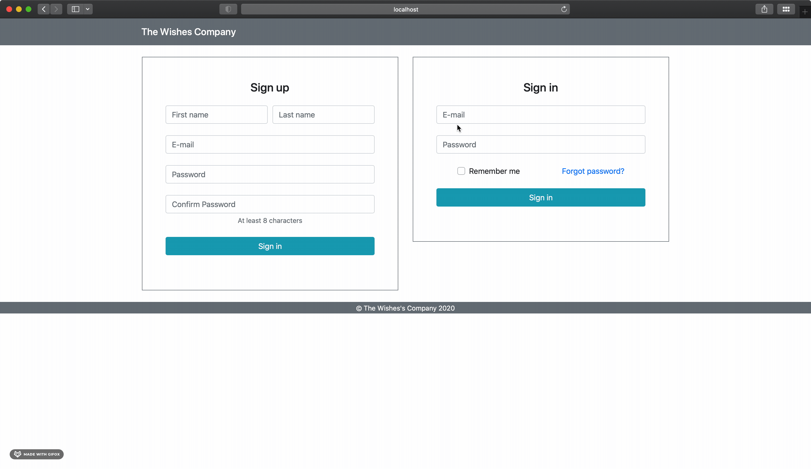
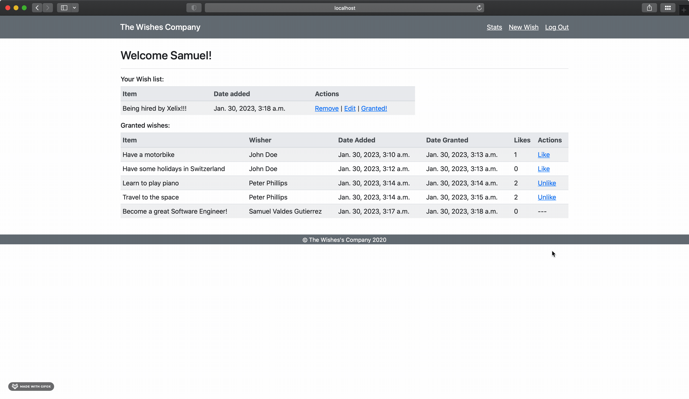

<a name="back-to-top"></a>

<!-- *********************************************************************** -->
<!-- 0.1) INTRO SHIELDS -->
<!-- *********************************************************************** -->

[![Github Follow][github-follow-badge]][github-follow-url]
[![LinkedIn Small][linkedin-badge-small]][linkedin-url]
[![Hackerrank Small][hackerrank-badge-small]][linkedin-url]
[![Ask Me Anything][ama-badge]][ama-url]
[![Say Thanks!][say-thanks-badge]][say-thanks-url]

<!-- *********************************************************************** -->
<!-- 0.3) PROJECT TITLE -->
<!-- *********************************************************************** -->

<!-- omit in toc -->

# The Wishes Company
[![License][license-badge]][license-url]
[![Forks][forks-badge]][forks-url]
[![Stars][stars-badge]][stars-url]
[![Watchers][watchers-badge]][watchers-url]

A simple Django web application implementing CRUD operations and authentication. 

> **NOTE**: Live demo available in following [link](here). Application deployed in AWS.

<br>

<p align="center">
  
</p>
<p align="center">
  
</p>


---

<!-- *********************************************************************** -->
<!-- 0.2) TABLE OF CONTENTS -->
<!-- *********************************************************************** -->

<!-- omit in toc -->

## Table of Contents

- [The Wishes Company](#the-wishes-company)
  - [Table of Contents](#table-of-contents)
  - [About The Project](#about-the-project)
  - [Technologies](#technologies)
  - [Getting Started](#getting-started)
  - [Contact Me](#contact-me)
  - [Support](#support)
  - [License](#license)

<p align="right">(<a href="#back-to-top">back to top</a>)</p>

---

<!-- *********************************************************************** -->
<!-- I) ABOUT THE PROJECT -->
<!-- *********************************************************************** -->

## About The Project

Educational project with the purpose of developing a basic implementation of a full-stack web application using Django framework and Python and HTML languages.

SQLite Database in repository with data already created. Existing users with following details:

* John Doe: 
  * email: johndoe@email.com
  * password: john123456
* Peter Phillips:
  * email: peterphillips@email.com
  * password: peter123456
* Samuel Valdes Gutierrez: 
  * email: samuel@email.com
  * password: samuel123456

<p align="right">(<a href="#back-to-top">back to top</a>)</p>

---

<!-- *********************************************************************** -->
<!-- II) TECHNOLOGIES -->
<!-- *********************************************************************** -->

## Technologies

The following technologies are used for the implementation of this project:

[![HTML5][html5-badge]][html5-url]
[![Python][python-badge]][python-url]
[![PyPI][pypi-badge]][pypi-url]
[![Django][django-badge]][django-url]
[![Bootstrap][bootstrap-badge]][bootstrap-url]
[![Jinja][jinja-badge]][jinja-url]
[![Jinja][sqlite-badge]][sqlite-url]

<p align="right">(<a href="#back-to-top">back to top</a>)</p>

---

<!-- *********************************************************************** -->
<!-- III) GETTING STARTED -->
<!-- *********************************************************************** -->

## Getting Started

IN PROGRESS....

<!-- ----------------------------------------------------------------------- -->
<!-- 3.1) Prerequisites -->
<!-- ----------------------------------------------------------------------- -->
<!-- ### Prerequisites

`Node.js` and `Node Package Manager (NPM)` are required for the setup of this web application.

> Installation instructions [here][install-node-js-and-npm-url].

> **NOTE:**  at the momment of creation of this project  `Node.js v18.6.0` and `NPM v9.4.0` were used. -->

<!-- 3.2) Installation -->
<!-- ----------------------------------------------------------------------- -->
<!-- ### Installation

To get a copy of this project and run it in your local environment, follow the steps listed below.

1. Clone the repo

   ```sh
   git clone https://github.com/BigSamu/Buda_Prices_ReactJS.git
   ```

2. Go into the repository

   ```sh
   cd Buda_Prices_ReactJS
   ```

3. Install required NPM packages or dependencies

   ```sh
   npm install
   ```

4. Run application

    ```sh
   npm run
   ```

<p align="right">(<a href="#back-to-top">back to top</a>)</p> -->

<!-- ----------------------------------------------------------------------- -->
<!-- 3.3) Usage -->
<!-- ----------------------------------------------------------------------- -->
<!-- ### Usage

After succesfull installation, you will be able to check the WebApp in any browser by visiting the following URL address: [localhost: 3000](http://localhost:3000/)

<p align="right">(<a href="#back-to-top">back to top</a>)</p> -->

---

<!-- *********************************************************************** -->
<!-- V) ACKNOWNLEDGEMENTS -->
<!-- *********************************************************************** -->

<!-- ## Acknowledgements

lipsum

<p align="right">(<a href="#back-to-top">back to top</a>)</p>

--- -->

<!-- *********************************************************************** -->
<!-- V) CONTACT ME -->
<!-- *********************************************************************** -->

## Contact Me

Feel free to contact me if you have any doubt!

Samuel Valdes Gutierrez

[![Gmail][gmail-badge]][gmail-url]
[![Twitter][twitter-badge]][twitter-url]
[![LinkedIn][linkedin-badge]][linkedin-url]
[![HackerRank][hackerrank-badge]][hackerrank-url]

<p align="right">(<a href="#back-to-top">back to top</a>)</p>

---

<!-- *********************************************************************** -->
<!-- VI) SUPPORT -->
<!-- *********************************************************************** -->

## Support

Whether you use this work to learn something or if you just like my work, please 🙏 consider supporting it. This aid will help me to dedicate more time to create and developed well design open-source projects.

[![Paypal][paypal-badge]][paypal-url]
[![Ko-Fi][ko-fi-badge]][ko-fi-url]
[![BuyMeACoffe][buy-me-a-coffee-badge]][buy-me-a-coffee-url]

<p align="right">(<a href="#back-to-top">back to top</a>)</p>

<!-- *********************************************************************** -->
<!-- VII) LICENSE -->
<!-- *********************************************************************** -->

---

## License

This project is licensed under the terms of the MIT license.

> You can check out the full license [here](./LICENSE.md)

<p align="right">(<a href="#back-to-top">back to top</a>)</p>

---

<!-- *********************************************************************** -->
<!-- VIII) FOOTER -->
<!-- *********************************************************************** -->

<p align="center">
Developed with ❤️ in Chile 🇨🇱  
</p>

<!-- *********************************************************************** -->
<!-- A) MARKDOWN LINKS & IMAGES -->
<!-- *********************************************************************** -->

<!-- ----------------------------------------------------------------------- -->
<!-- A.1) Teachnologies -->
<!-- ----------------------------------------------------------------------- -->

<!-- 1) Programming Languages -->

<!-- HTML5 -->

[html5-badge]: https://img.shields.io/badge/HTML5-E34F26?logo=html5&logoColor=fff&style=for-the-badge
[html5-url]: https://dev.w3.org/html5/spec-LC/

<!-- Javascript -->

[javascript-badge]: https://img.shields.io/badge/JavaScript-F7DF1E?logo=javascript&logoColor=000&style=for-the-badge
[javascript-url]: https://www.javascript.com/

<!-- Python -->

[python-badge]: https://img.shields.io/badge/Python-3776AB?logo=python&logoColor=fff&style=for-the-badge
[python-url]: https://www.python.org/

<!-- Ruby -->

[ruby-badge]: https://www.ruby-lang.org/
[ruby-url]: https://www.ruby-lang.org/

<!-- 2) Frontend Frameworks and Libraries -->

<!-- ReactJS -->

[react-js-badge]: https://img.shields.io/badge/React-61DAFB?logo=react&logoColor=000&style=for-the-badge
[react-js-url]: https://reactjs.org/

<!-- Bootstrao -->

[bootstrap-badge]: https://img.shields.io/badge/bootstrap-%23563D7C.svg?style=for-the-badge&logo=bootstrap&logoColor=white
[bootstrap-url]: https://getbootstrap.com/

<!-- Jinja -->

[jinja-badge]: https://img.shields.io/badge/Jinja-B41717?logo=jinja&logoColor=fff&style=for-the-badge
[jinja-url]: https://jinja.palletsprojects.com/

<!-- 3) Backend Frameworks and Libraries -->
<!-- Sinatra Ruby -->

[ruby-sinatra-badge]: (https://img.shields.io/badge/Ruby%20Sinatra-000?logo=rubysinatra&logoColor=fff&style=for-the-badge)
[ruby-sinatra-url]: https://sinatrarb.com/

<!-- Django -->

[django-badge]: https://img.shields.io/badge/Django-092E20?logo=django&logoColor=fff&style=for-the-badge
[django-url]: https://www.djangoproject.com/

<!-- 4) Databases -->

<!-- SQLite -->

[sqlite-badge]: https://img.shields.io/badge/SQLite-003B57?logo=sqlite&logoColor=fff&style=for-the-badge
[sqlite-url]: https://sqlite.org/

<!-- 5) Development Environments & Package Managers -->

<!-- NodeJS -->

[node-js-badge]: https://img.shields.io/badge/node.js-6DA55F?style=for-the-badge&logo=node.js&logoColor=white
[node-js-url]: https://nodejs.org/

<!-- NPM -->

[npm-badge]: https://img.shields.io/badge/npm-CB3837?logo=npm&logoColor=fff&style=for-the-badge
[npm-url]: https://www.npmjs.com/

<!-- RubyGems-->

[ruby-gems-badge]: https://img.shields.io/badge/RubyGems-E9573F?logo=rubygems&logoColor=fff&style=for-the-badge
[ruby-gems-url]: https://rubygems.org/

<!-- PyPI -->

[pypi-badge]: https://img.shields.io/badge/PyPI-3775A9?logo=pypi&logoColor=fff&style=for-the-badge
[pypi-url]: https://pypi.org/

<!-- ----------------------------------------------------------------------- -->
<!-- A.2) Github Stats -->
<!-- ----------------------------------------------------------------------- -->

<!-- Forks -->

[forks-badge]: https://img.shields.io/github/forks/BigSamu/The_Wishes_Company.svg
[forks-url]: https://github.com/BigSamu/The_Wishes_Company/network/members

<!-- Stargazers -->

[stars-badge]: https://img.shields.io/github/stars/BigSamu/The_Wishes_Company.svg
[stars-url]: https://github.com/BigSamu/The_Wishes_Company/stargazers

<!-- Watchers -->

[watchers-badge]: https://img.shields.io/github/watchers/BigSamu/The_Wishes_Company.svg
[watchers-url]: https://github.com/BigSamu/The_Wishes_Company/watchers

<!-- License -->

[license-badge]: https://img.shields.io/badge/license-MIT-green
[license-url]: ./LICENSE.md

<!-- Follow -->

[github-follow-badge]: https://img.shields.io/github/followers/BigSamu.svg?style=social&label=Follow
[github-follow-url]: https://github.com/BigSamu?tab=followers

<!-- ----------------------------------------------------------------------- -->
<!-- A.3) Contact -->
<!-- ----------------------------------------------------------------------- -->

<!-- Gmail -->

[gmail-badge]: https://img.shields.io/badge/Gmail-D14836?style=for-the-badge&logo=gmail&logoColor=white
[gmail-url]: mailto:valdesgutierrez@gmail.com

<!-- Twitter -->

[twitter-badge]: https://img.shields.io/badge/Twitter-%231DA1F2.svg?style=for-the-badge&logo=Twitter&logoColor=white
[twitter-url]: https://twitter.com/BigSamu5

<!-- LinkedIn -->

[linkedin-badge]: https://img.shields.io/badge/linkedin-%230077B5.svg?style=for-the-badge&logo=linkedin&logoColor=white
[linkedin-badge-small]: https://img.shields.io/badge/--linkedin?label=LinkedIn&logo=LinkedIn&style=social
[linkedin-url]: https://www.linkedin.com/in/samuel-valdes-gutierrez

<!-- HackerRank -->

[hackerrank-badge]: https://img.shields.io/badge/-Hackerrank-2EC866?style=for-the-badge&logo=HackerRank&logoColor=white
[hackerrank-badge-small]: https://img.shields.io/badge/--hackerrank?label=HackerRank&logo=hackerrank&style=social
[hackerrank-url]: https://www.hackerrank.com/BigSamu

<!-- Ask Me Anything -->

[ama-badge]: https://img.shields.io/badge/Ask%20me-anything-1abc9c.svg
[ama-url]: #contact-me

<!-- Say Thanks -->

[say-thanks-badge]: https://img.shields.io/badge/Say%20Thanks-!-1EAEDB.svg
[say-thanks-url]: https://saythanks.io/to/BigSamu

<!-- ----------------------------------------------------------------------- -->
<!-- A.4) Support -->
<!-- ----------------------------------------------------------------------- -->

<!-- Paypal -->

[paypal-badge]: https://img.shields.io/badge/PayPal-00457C?style=for-the-badge&logo=paypal&logoColor=white
[paypal-url]: https://www.paypal.com/paypalme/BigSamu87/2

<!-- Ko-Fi -->

[ko-fi-badge]: https://img.shields.io/badge/Ko--fi-F16061?style=for-the-badge&logo=ko-fi&logoColor=white
[ko-fi-url]: https://ko-fi.com/BigSamu

<!-- Buy Me a Coffee -->

[buy-me-a-coffee-badge]: https://img.shields.io/badge/Buy%20Me%20a%20Coffee-ffdd00?style=for-the-badge&logo=buy-me-a-coffee&logoColor=black
[buy-me-a-coffee-url]: https://www.buymeacoffee.com/BigSamu

<!-- *********************************************************************** -->
<!-- B) INSTALLATION INSTRUCTIONS ENVIRONMENTS & PACKAGE MANAGERS -->
<!-- *********************************************************************** -->

<!-- Node.js and NPM -->

[install-node-js-and-npm-url]: https://gist.github.com/MichaelCurrin/aa1fc56419a355972b96bce23f3bccba

<!-- Ruby, Rubygems and Bundler -->

[install-ruby-and-bundler]: https://gist.github.com/MichaelCurrin/fb758aea4d35e03b9ed093afddf4e7ec
